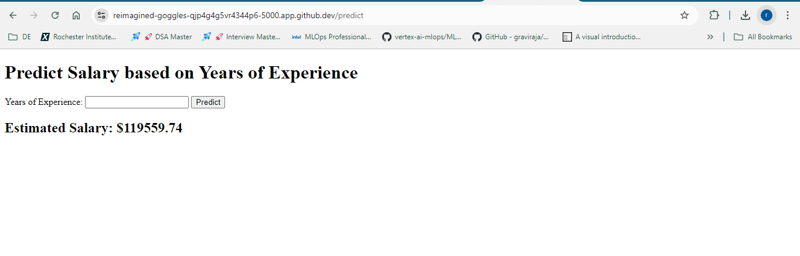

# MLops_capstone_edureka

# Salary Prediction Flask App

Using a pre-trained linear regression model, this simple Flask application predicts salary based on years of experience. The app provides a form for users to input their years of experience and receive an estimated salary.
## Demo

### Getting Started

To run this application locally, follow these steps:

### 1. [Clone the Repository](https://github.com/ranjithnrjk/MLops_capstone_edureka.git)
```bash
git clone https://github.com/ranjithnrjk/MLops_capstone_edureka.git
cd MLops_capstone_edureka
```

### 2. Install Required Dependencies
<p>Make sure you have Python installed. To install the necessary libraries, run:</p><br>

```
pip install -r requirements.txt
```

### 3. RUN the app
<p>Once the libraries are installed, run the Flask app</p>

```
python app.py
```

### 4. Access the Application
Once the app is running, open a browser and go to the link displayed in the terminal, usually, it is:
```
http://127.0.0.1:5000/
```

<p>You will be presented with a form where you can input 
<b>Years of Experience</b> to estimate the <b>Salary</b>.</p>


## Developemt

Three models have been used to experiment on the data to examine the linear and non-linear relationships.
<ol>
<li>Linear Regression</li>
<li>Decision Tree Regression</li>
<li>Random Forest Regression</li>
</ol>

The experiment logs are pushed to `dagshub` and can be accessed here [Experiments_DagsHub](https://dagshub.com/ranjithkumarneeruganti/MLops_capstone_edureka)
<br>


Here is the simple UI created for the app:<br>


